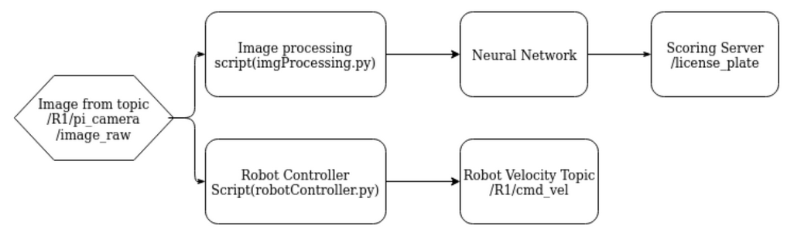

# tofu_the_autonomous_parking_patroller
ENPH 353 Competition: An agent developed using Python to navigate through a simulated course, detect license plates of parked cars, and avoid pedestrians utilizing a state machine with image feed as inputs and velocity commands as outputs.

_Figure 1: A bird's-eye view of the competition environment & our robot, Tofu._

The tasks our robot had to accomplish for the competition were:

1. Drive withing the white lines of the road and navigate the parking lot.
2. Avoiding collisions with pedestrians intermittently crossing at two cross-walks.

_Figure 2: A pedestrian crossing from Tofu's point of view._

3. Read license plates and parking stall numbers of parked vehicles.

_Figure 3: A parked vehicle, with its parking stall number and license plate in view._

An overview summarizing our software architecture is included below:

